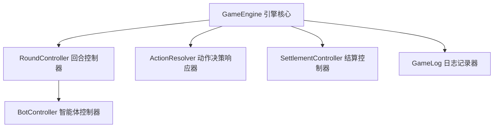

# 长沙麻将对局状态机 (v0.2) 开发者报告

本项目在 v0.1 规则引擎（麻将牌生成、洗牌、合法吃碰杠胡判断及计分）的基础上，实现了 **“长沙麻将对局状态机 v0.2”**。实现了从起手发牌、摸牌打牌、吃碰杠胡响应决策、抢杠胡判定、海底捞月流程到一炮多响合并结算的完整闭环，并通过控制台模拟器实现了可自动流转的控制台演示。

---

## 一、 系统架构与模块设计

对局状态机由以下核心控制器与模块组成：



### 1. 核心状态定义 (`types/game.ts`)
*   **`GamePhase` 对局阶段**：
    *   `init`: 游戏初始化。
    *   `startingHu`: 庄家起手判定与闲家起手胡选择。
    *   `playing`: 标准摸牌/打牌阶段。
    *   `waitingForResponses`: 打牌后等待其他玩家响应阶段（胡、碰、吃、杠等）。
    *   `qiangGangHu`: 抢杠胡响应判定阶段。
    *   `gangReplacement`: 杠后补张阶段。
    *   `haiDi`: 海底捞月阶段。
    *   `ended`: 对局正常结束或流局。
*   **`GameState` 统一状态实体**：
    包含牌墙 (`wall`)、所有玩家的牌及状态 (`players`)、当前轮风/操作座位 (`currentSeat`)、待响应动作队列 (`pendingActions`)、当前胡牌赢家座位 (`winnerSeats`)、历史事件日志 (`logs`)、本局结算事件 (`scoreEvents`) 等。

### 2. 回合控制 (`controller/round-controller.ts`)
*   负责基础的**摸牌** (`drawTile`)、**打牌** (`discardTile`) 与**座位轮转** (`moveToNextSeat`)。
*   **海底牌判定**：当牌墙只剩 1 张牌时，系统流转至 `haiDi` 阶段。玩家将按座位序决定是否摸起最后一张海底牌。若全部放弃则判定流局。

### 3. 动作决策响应器 (`controller/action-resolver.ts`)
*   **优先级排序**：根据长沙麻将规则，玩家对打出牌的响应动作优先级为：`胡 (hu) > 杠 (gang) > 碰 (peng) > 吃 (chi) > 过 (pass)`。
*   **动作收集与选择**：
    *   打牌后，系统收集所有其他玩家的可行操作生成 `pendingActions`，状态切换至 `waitingForResponses`。
    *   在有玩家进行选择后，系统比较所有动作的优先级，只执行**最高优先级**的操作。如果最高优先级操作是 `hu`，且有多名玩家同时选择 `hu`，则识别为**一炮多响 (MultiHu)**，并同时结算。
*   **抢杠胡 (QiangGangHu)**：当有玩家执行补杠 (BuGang) 时，其他玩家可声明抢杠胡。若有抢杠胡，则打断补杠流程，直接转为 DianPao 胡牌结算；否则补杠成功，从牌墙后补张。

### 4. 智能体 Bot 控制 (`controller/bot-controller.ts`)
*   实现了一个极简但完全合法的 AI Bot 决策逻辑：
    1.  **主动或响应胡牌**：若判定有 `hu` 可选，始终优先选择胡牌。
    2.  **放弃其他吃碰杠响应**：为简化对局，AI 在吃碰杠等响应选择时始终选择 `pass`。
    3.  **打牌逻辑**：当轮到打牌时，自动排序手牌，并打出最后一张。不打出不存在的牌。

### 5. 结算控制 (`controller/settlement-controller.ts`)
*   包含起手胡分、杠钱事件、基础胡牌计分及大胡叠加结算。
*   **扎鸟 (Zha Niao)**：胡牌结算时，依据配置的鸟数从牌墙顶端摸牌，计算各张鸟牌对赢家和输家结算的翻倍或加分乘数。
*   **流局结算**：无赢家，记录分数为 0，并将游戏阶段置为 `ended`。

---

## 二、 核心约束与不变式 (Invariants)

为了确保状态机在任何复杂场景下均不崩溃、不陷入死循环且牌数不丢失，我们在开发中强制执行了以下两条**不变式**：

1.  **最高步数上限 (Max Step Limit)**：每次调用 `stepGame`，控制台模拟器内部设置了最大 **500 步** 的执行上限。如果由于逻辑 Bug 导致状态机循环，系统将主动抛出错误以防止死循环挂起。
2.  **牌数守恒定律 (Card Count Conservation)**：
    长沙麻将一共 108 张牌。在对局状态机运行的任何一个时间点，以下等式必须绝对成立：
    $$\sum_{p \in Players} (\text{手牌数} + \text{副露牌数} + \text{弃牌数}) + \text{牌墙剩余牌数} = 108$$
    当玩家进行吃、碰、杠等副露操作时，被吃碰杠的牌会**动态从原出牌者的弃牌堆中移除**，并合并入吃碰碰者的副露中，从而杜绝多牌或漏牌。

---

## 三、 自动化测试与验证

我们基于 **Vitest** 编写了全面、细致的自动化测试用例，覆盖了从 pure functions 规则校验到上层状态机回放的各个维度。

### 1. 验证结果摘要
*   **运行状态**：测试全部通过 (`PASSED`)。
*   **测试文件数**：13 个测试文件 (13 test files)。
*   **总测试用例数**：**90 个测试用例 (90 test cases)**。
*   **编译验证**：`tsc --noEmit` 编译通过，无任何 TypeScript 类型和定义警告。

### 2. 状态机新增的 5 个测试套件 (`src/changsha-mahjong/__tests__/`)
1.  **`game-engine.test.ts`**：验证状态初始化、起手分牌数量（庄家 14 张，闲家 13 张，墙牌 55 张）、日志记录以及在每个流转周期的牌数守恒。
2.  **`round-controller.test.ts`**：验证摸牌后手牌数增加、打牌后手牌减少且进入弃牌区、无人响应自动轮转、牌墙为空流局、牌墙剩 1 张进入海底流程。
3.  **`action-resolver.test.ts`**：验证动作队列的优先级排序 (胡 > 杠 > 碰 > 吃 > 过)、吃牌仅限下家约束、多人胡判定（一炮多响）、以及无人响应时安全 Pass 的机制。
4.  **`settlement-controller.test.ts`**：测试点炮胡、自摸胡、一炮多响的结算分值、杠钱结算、扎鸟翻倍计算、流局结算，以及最终格式化摘要的生成。
5.  **`console-simulator.test.ts`**：在多组随机 seed 下运行完整闭环对局，验证其稳定性、无死循环、以及对局结束后牌数严格等于 108。

---

## 四、 如何运行演示与测试

您可以通过以下 npm 脚本执行测试和进行开发验证：

### 1. 运行所有单元测试
```bash
npm test
```

### 2. 检查 TS 类型正确性
```bash
npx tsc --noEmit
```
