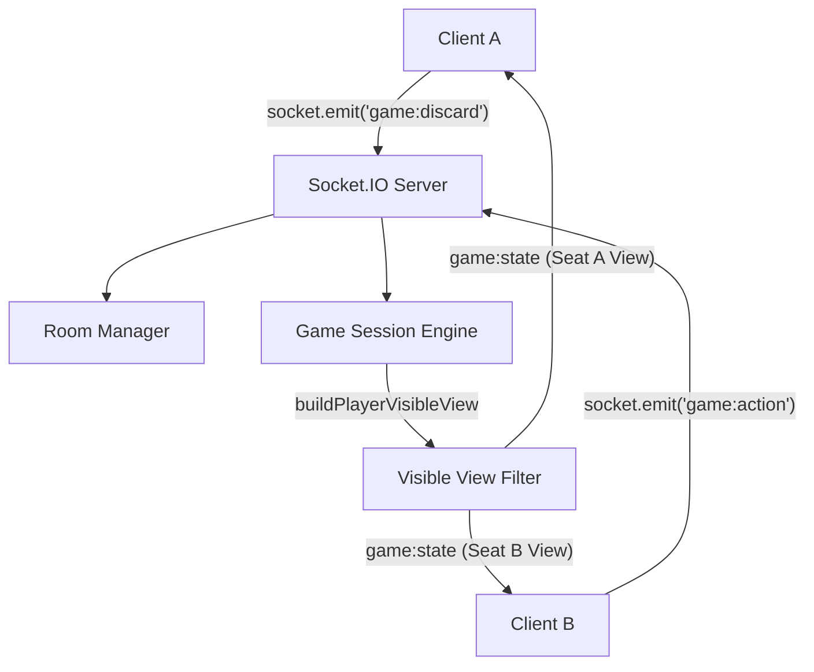

# 长沙麻将多人联网小原型 (v0.8) 开发报告

本报告阐述了长沙麻将多人联网原型（v0.8）的架构设计、安全隔离策略、网络事件、测试用例覆盖及运行指南。

---

## 一、系统架构设计

多人联网采用 **服务端权威状态机 (Server-Authoritative)** 架构，前端仅做视图渲染与用户操作上报。



- **数据流向**：客户端发送决策指令 -> 服务端加锁验证 -> 推进对局状态机 -> 过滤私有数据 -> 广播个性化隔离视图。
- **状态一致性**：整个房间共享唯一的 `GameState`，内存级非持久化存储，无需任何数据库依赖。

---

## 二、信息隔离与防作弊设计 (Information Boundary)

为保证对局公平性与安全性，v0.8 从物理上杜绝了客户端获取未公开牌局数据的可能性。

1. **手牌隔离**：`view.self.hand` 仅包含当前客户端对应的玩家手牌。所有对手的 `hand` 数组在对局结束前皆被隐去（在 JSON 传输中为 `undefined`），对手手牌仅露出牌数 `handCount`。
2. **牌墙隐藏**：不对客户端传输 `state.wall` 的具体牌型和排序，仅暴露剩余牌数 `wallRemainingCount`。
3. **日志脱敏**：重构并替换了 `filterLogsForSeat` 函数。当其他对手摸牌时，日志过滤会隐去摸到的牌（例如，隐藏 `玩家1 摸牌，tong_2`，当前玩家只能看到 `玩家1 摸牌`）。
4. **结算揭开手牌**：只有在对局结束且 `state.phase === 'ended'` (即结算状态) 时，才会在 view 中对所有对手填充 `opponents[i].hand` 数组，展示各家手牌。

---

## 三、网络事件设计

### 1. Client → Server (客户端指令)
- `room:create`：创建房间。
- `room:join`：加入房间（带昵称）。
- `room:fill-ai`：将空闲的座位填充为 Advanced Lite AI。
- `game:start`：开始联网对局。
- `game:discard`：出牌（提交 `tileInstanceId`，由服务端核验）。
- `game:action`：吃、碰、杠、胡、过响应（吃牌提交 `optionId`，杠牌提交 `tileKey`）。
- `game:sync`：断线重连或手动状态同步。

### 2. Server → Client (服务端更新)
- `room:created`：房间创建回执（返回分配的房间号和座位）。
- `room:joined`：房间加入回执。
- `room:updated`：等待大厅状态更新（包含连接状态与空余座位）。
- `game:state`：更新客户端的个性化物理隔离视图。
- `error`：异常动作拒绝消息。

---

## 四、测试用例与质量保障

新增了 6 个联机模块专用测试文件，共增加 **36 个高精度测试用例**。累计总测试用例数增加至 **490 个**，Vitest 测试通过率达 **100%**。

### 1. 新增测试分类
- **[server-visible-view.test.ts](file:///c:/Users/hn511/Desktop/VibeCoding/RealMapTeach/src/changsha-mahjong-network/__tests__/server-visible-view.test.ts)** (8 个用例)：验证隔离手牌、隐藏牌墙、过滤特定日志、按座位过滤动作以及结算时揭示暗牌。
- **[room-manager.test.ts](file:///c:/Users/hn511/Desktop/VibeCoding/RealMapTeach/src/changsha-mahjong-network/__tests__/room-manager.test.ts)** (8 个用例)：验证创建房间、房间号唯一性、满房阻拦、AI 补位及空房清理。
- **[game-session.test.ts](file:///c:/Users/hn511/Desktop/VibeCoding/RealMapTeach/src/changsha-mahjong-network/__tests__/game-session.test.ts)** (6 个用例)：验证游戏初始化、出牌次序强校验、持有牌检验及并发动作锁拦截。
- **[network-actions.test.ts](file:///c:/Users/hn511/Desktop/VibeCoding/RealMapTeach/src/changsha-mahjong-network/__tests__/network-actions.test.ts)** (6 个用例)：校验出牌、吃碰杠胡和过动作的数据映射及选项重组。
- **[online-game-flow.test.ts](file:///c:/Users/hn511/Desktop/VibeCoding/RealMapTeach/src/changsha-mahjong-network/__tests__/online-game-flow.test.ts)** (3 个用例)：多玩家 + AI 自动推进完整环路测试。
- **[hidden-info-leak.test.ts](file:///c:/Users/hn511/Desktop/VibeCoding/RealMapTeach/src/changsha-mahjong-network/__tests__/hidden-info-leak.test.ts)** (5 个用例)：严苛核对 JSON 序列化中不得出现任何对手的 tile `instanceId` 以及未来摸牌详情。

---

## 五、部署与运行说明

### 1. 服务启动指令
- 启动联网大厅及对局服务（默认 3001 端口）：
  ```bash
  npm run server
  ```
- 启动前端开发服务器（默认 5173 端口）：
  ```bash
  npm run dev
  ```
- 或者使用统一编译并拉起服务：
  ```bash
  npm run dev:online
  ```

### 2. 联机游玩验证
1. 访问网页后，点击顶部的 `多人联机模式 (v0.8)` 导航栏。
2. 输入昵称创建房间，获得 6 位数字短码（例如 `482910`）。
3. 另开浏览器页签加入该房间。
4. 一键补齐 AI 机器人，点击开始游戏，开启属于您的联机长沙麻将！
