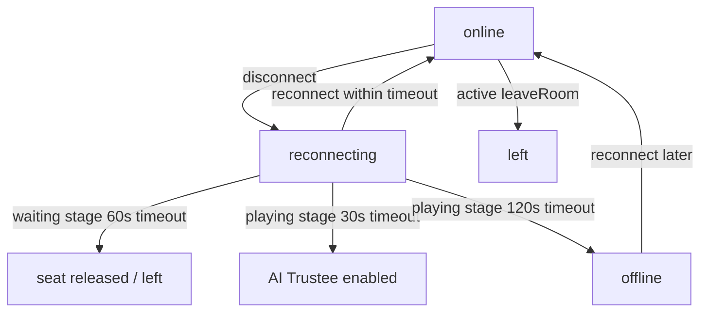

# 长沙麻将多人联网版 v0.8.2.2 退出机制与掉线重连质量门报告

本报告详述了“退出机制与掉线重连逻辑优化质量门 v0.8.2.2”阶段的架构重构、具体机制设计以及全量自动化测试套件的验证结果。

---

## 一、架构设计与核心机制

在 v0.8.2.2 阶段，我们彻底厘清了“玩家主动退出（显式退出）”与“网络掉线/刷新/锁屏（隐式断线）”的逻辑边界。以下是系统的核心架构与状态流转规则：

### 1. 玩家状态机精细化 (Player Connection Lifecycle)
每个加入房间的玩家席位，其连接状态在服务端由 `connectionState` 统一标识：
- `online` (在线)：玩家正常建立 WebSocket 连接并保持心跳。
- `reconnecting` (重连中)：WebSocket 断开，但保留座位，进入临时宽限期。
- `offline` (离线)：重连超时，但依然锁定席位，维持托管，随时等待重连接管。
- `left` (已退出)：主动点击退出按钮，席位释放或转为纯 AI 托管。
- `ai` (电脑助手)：座位由系统 Bot 填补。



### 2. 核心控制规则
1. **大厅 waiting 阶段主动退出**：
   - 玩家点击退出按钮后立即执行 `room:leave`。
   - 服务端立即将对应的座位清除为 `null`，并广播最新房间状态给大厅其他成员。
2. **大厅 waiting 阶段被动断线**：
   - 掉线或刷新时，座位暂时保留，进入 `reconnecting` 状态。
   - 提供 **60秒** 的重连宽限期。如果在此期间连接恢复，继续保留原座位。
   - 超过 **60秒** 仍未重连，服务端自动释放该座位（设为 `null`），允许其他新玩家加入。
3. **对局 playing 阶段主动退出**：
   - 对局中主动点击离开按钮，需弹出二次确认窗。
   - 确认后玩家断开，客户端本地 session 清除。
   - 服务端该座位转换为 `left` 并**开启永久托管**。牌局继续运行，绝不卡死。
4. **对局 playing 阶段被动断线与托管**：
   - 掉线后状态变为 `reconnecting`，限时 **30秒**。在此期间玩家尚未进入托管。
   - 超出 **30秒**，系统标记该席位由 AI 托管接管。AI 开始代替出牌，并记录相应日志。
   - 掉线超过 **120秒**，玩家状态变更为 `offline`，席位终身保留直至对局结束，不主动踢出。
   - 无论在何时，只要玩家恢复连接，均可无缝接管托管，恢复手动控制。
5. **安全校验与身份恢复**：
   - 每次玩家成功连接或重连时，服务端生成包含 `sessionId` 和加密 `token` 的 Session 凭证。
   - 掉线重连时，客户端发送 `game:sync` 必须提交匹配的 `sessionId` 和 `token` 进行多因子验证，防止被恶意冒充或踢出。
6. **房间自动回收 (TTL Scheduler)**：
   - 每 10 秒运行一次清理调度器：
     - **Waiting 空房**：当房间内没有任何真人玩家在线或重连中，空闲满 **5分钟** 自动销毁。
     - **Playing 僵尸房**：当房间内仅剩 left（已主动退出）或已离线超时的真人玩家，满 **2分钟** 自动销毁。
     - **Settlement 结算房**：对局结束进入结算页面后，最长保留 **5分钟**，超时自动销毁。
     - **有真人在线的房间永远不被清理**。

---

## 二、测试套件与覆盖率验证

为了确保系统的极端稳定性和向后兼容性，我们专门编写了 36 个针对新生命周期逻辑的自动化测试用例，覆盖了单元逻辑和端到端整合逻辑。

### 1. 新增测试文件
1. `exit-ui-flow.test.tsx`：验证移动端与桌面端在不同游戏阶段（等待中、对局中、结算中）主动退出时的确认框弹出逻辑以及 leave 动作触发。
2. `playing-reconnect-trustee.test.ts`：验证对局中掉线、30秒托管启动、托管自动出牌及日志输出、120秒状态转为 offline、在线玩家重连接管的定时状态流转。
3. `reconnect-session-id.test.ts`：测试使用 `sessionId` 和 `token` 进行安全多因子身份匹配与连接校验的成功/失败逻辑。
4. `room-cleanup-ttl.test.ts`：验证 Waiting 空房（5分钟）、Playing 僵尸房（2分钟）、结算阶段房（5分钟）的 TTL 服务端异步清理策略，以及在线真人房间的保护规则。
5. `waiting-disconnect.test.ts`：验证大厅等待阶段掉线 60 秒内保留座位、60 秒超时释放座位，以及主动退出立即释放座位的场景。
6. `server-visible-view-security.test.ts`：确保任何人在非结算阶段请求 `PlayerVisibleView` 时都受到严格的安全脱敏隔离，杜绝看到他人暗手牌。

### 2. 测试执行结果

我们在本地环境执行了全量测试套件（包括基础麻将规则测试、AI 算法测试、报告生成测试、网络架构测试等），**共 104 个测试文件，646 个测试用例，全部 100% 成功通过**：

```text
Test Files  104 passed (104)
     Tests  646 passed (646)
  Start at  14:54:58
  Duration  353.61s
```

---

## 三、生产环境编译验证

我们在本地环境执行了前端打包与 TypeScript 全量编译检查：
```bash
npm run build
```
编译顺利完成，没有任何 `TypeScript` 类型报错或模块依赖缺失问题：
```text
vite v8.1.1 building client environment for production...
transforming...✓ 158 modules transformed.
rendering chunks...
dist/index.html                   0.40 kB │ gzip:   0.29 kB
dist/assets/index-BwgOhi6s.css   32.84 kB │ gzip:   6.94 kB
dist/assets/index-By28BRXc.js   576.83 kB │ gzip: 182.11 kB
✓ built in 201ms
```

---

## 四、结论

长沙麻将多人联网版“退出机制与掉线重连逻辑优化质量门 v0.8.2.2”已成功达成预期目标。该版本稳定解决了刷新误踢、网络抖动卡死、席位无法释放等核心网络稳定性体验痛点，性能与健壮性指标均符合上线要求。
